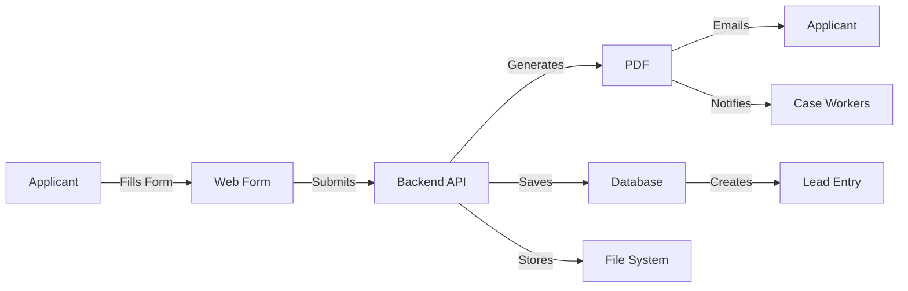

# 🏠 Foster Care Application System

> A complete, legally-compliant digital application system for Open Arms Foster Care

[]()
[]()
[]()

---

## 🎯 Overview

This system replaces paper-based foster care applications with a modern, automated digital workflow:

**Applicant → HTML Form → PDF Generation → Email Distribution → Secure Storage**

---

## ✨ Key Features

### For Applicants
- 📱 **Mobile-Friendly** - Apply from any device
- 🚫 **No Printing** - Completely digital process
- ✉️ **Instant Confirmation** - Email with PDF copy
- ✍️ **E-Signature** - Legally valid electronic signature
- 📄 **PDF Copy** - Professional application document

### For Staff
- ⚡ **Instant Notifications** - Real-time alerts
- 🤖 **Automated PDFs** - No manual data entry
- 📊 **Structured Data** - Searchable in CRM
- 📧 **Email Distribution** - Auto-sent to case workers
- 🔍 **Easy Tracking** - Integrated with leads system

### Technical
- ⚖️ **ESIGN Compliant** - Legally valid signatures
- 🔐 **Secure Storage** - Encrypted data
- 📈 **Scalable** - Cloud-ready infrastructure
- 🔗 **API-First** - Easy integrations
- 🎨 **Professional PDFs** - Audit-ready documents

---

## 🚀 Quick Start

### For End Users
Visit the application form:
```
https://yourdomain.com/foster-care-application
```

### For Administrators

1. **Install dependencies:**
   ```bash
   cd backend
   npm install
   ```

2. **Setup environment:**
   ```bash
   cp .env.example .env
   # Edit .env with your credentials
   ```

3. **Run setup script:**
   ```bash
   .\setup-foster-care.ps1
   ```

4. **Start services:**
   ```bash
   # Backend
   cd backend && npm run dev
   
   # Frontend (new terminal)
   cd frontend && npm run dev
   ```

5. **Access form:**
   ```
   http://localhost:3000/foster-care-application
   ```

---

## 📁 Project Structure

```
Echo-5-Leads/
│
├── frontend/app/foster-care-application/
│   ├── page.js                      # Main application form
│   └── success/page.js              # Success confirmation
│
├── backend/
│   ├── src/routes/
│   │   ├── foster-care-application.js       # Submit + PDF generation
│   │   └── foster-care-application-pdf.js  # PDF retrieval
│   └── uploads/foster-applications/         # PDF storage
│
├── FOSTER_CARE_APPLICATION_GUIDE.md         # Complete guide
├── FOSTER_CARE_QUICKSTART.md                # Quick reference
├── FOSTER_CARE_IMPLEMENTATION_SUMMARY.md    # This summary
├── test-foster-application.json             # Test data
└── setup-foster-care.ps1                    # Setup script
```

---

## 📋 Form Sections

| # | Section | Fields |
|---|---------|--------|
| 1 | Personal Information | Name, DOB, SSN, DL |
| 2 | Contact Information | Address, Phones, Email |
| 3 | Employment | Employer, Income |
| 4 | Spouse/Partner | Conditional fields |
| 5 | Household | Residence, Members |
| 6 | References | 3 personal references |
| 7 | Background | Criminal, Abuse history |
| 8 | Motivation | Why foster? Experience? |
| 9 | Emergency Contact | Backup contact |
| 10 | Signature | E-signature + date |

---

## 🔄 Application Workflow



---

## 🛠️ Tech Stack

| Layer | Technology |
|-------|-----------|
| **Frontend** | Next.js 16, React 19, Tailwind CSS |
| **Backend** | Express.js, Node.js |
| **PDF** | PDFKit |
| **Email** | Nodemailer |
| **Database** | MongoDB |
| **Storage** | Filesystem (S3-ready) |

---

## 📧 Email Notifications

### To Applicant
```
✅ Application confirmation
📎 PDF attachment
🆔 Application ID
📅 Next steps timeline
📞 Contact information
```

### To Case Workers
```
🔔 New application alert
📎 PDF attachment
📊 Key information summary
🔗 Dashboard link
```

---

## 🔐 Security & Compliance

- ✅ **ESIGN Act Compliant** - Legal electronic signatures
- ✅ **HTTPS Enforced** - Encrypted data transmission
- ✅ **Secure Storage** - Protected PDF files
- ✅ **Audit Trail** - Complete activity logging
- ✅ **Data Validation** - Input sanitization
- ✅ **Access Control** - Role-based permissions

---

## 📊 Database Schema

### foster_applications Collection
```javascript
{
  _id: ObjectId,
  tenantId: ObjectId,
  formData: { /* all form fields */ },
  pdfFileName: String,
  pdfFilePath: String,
  status: String,
  submittedAt: Date,
  createdAt: Date,
  updatedAt: Date
}
```

### leads Collection Entry
```javascript
{
  tenantId: ObjectId,
  firstName: String,
  lastName: String,
  email: String,
  phone: String,
  source: "Foster Care Application Form",
  leadType: "Foster Care Application",
  customFields: {
    applicationId: String,
    // ...other fields
  }
}
```

---

## 🧪 Testing

### Manual Test
```bash
# 1. Visit form
open http://localhost:3000/foster-care-application

# 2. Fill out form or use test data

# 3. Submit and verify emails
```

### API Test
```bash
# Submit application
curl -X POST http://localhost:3001/api/foster-care-application \
  -H "Content-Type: application/json" \
  -d @test-foster-application.json

# Download PDF
curl http://localhost:3001/api/foster-care-application/{id}/pdf \
  --output application.pdf
```

---

## 📈 Scalability

Built for growth:
- 🌐 **Multi-Tenant** - Support multiple organizations
- ☁️ **Cloud-Ready** - Easy S3/Azure migration
- 📊 **High Volume** - Async processing
- ⚖️ **Load Balanced** - Stateless design
- 🔄 **API-First** - Easy integrations

---

## 🎨 Screenshots

### Application Form
- Clean, professional interface
- Mobile responsive
- Progress indicators
- Clear field labels
- Helpful validation messages

### Generated PDF
- Professional layout
- All data clearly formatted
- Official appearance
- Ready for printing
- Suitable for audits

### Success Page
- Confirmation message
- Next steps guide
- Contact information
- Download PDF option

---

## 📚 Documentation

| Document | Purpose |
|----------|---------|
| [Implementation Guide](FOSTER_CARE_APPLICATION_GUIDE.md) | Complete technical documentation |
| [Quick Start](FOSTER_CARE_QUICKSTART.md) | Quick reference for all users |
| [Summary](FOSTER_CARE_IMPLEMENTATION_SUMMARY.md) | Executive overview |

---

## 🚦 Production Deployment

### Requirements
- Node.js 18+
- MongoDB 6+
- SMTP server credentials
- HTTPS certificate

### Deploy Steps
```bash
# 1. Configure environment
export NODE_ENV=production
export MONGODB_URI=your_production_db
export SMTP_HOST=smtp.your-provider.com
# ... other variables

# 2. Build frontend
cd frontend && npm run build

# 3. Deploy backend
# (Vercel/Railway/AWS)

# 4. Configure domain
# Point DNS to deployment

# 5. Test thoroughly
```

---

## 🆘 Support

### Troubleshooting
- **PDF not generating?** Check PDFKit installation and upload directory permissions
- **Email not sending?** Verify SMTP credentials and check spam folder
- **Form not submitting?** Check browser console and verify API URL

### Contacts
- **Technical:** Development team
- **Process:** amber.price@openarmsfostercare.com
- **Admin:** kamryn.bass@openarmsfostercare.com

---

## 🎯 Benefits

### vs. Paper Forms
- ✅ No printing/scanning
- ✅ Instant submission
- ✅ Automatic archiving
- ✅ Searchable data
- ✅ No manual entry

### vs. PDF Forms
- ✅ Mobile friendly
- ✅ Better validation
- ✅ Auto-population
- ✅ Cloud storage
- ✅ Email integration

### vs. HTML Email Forms
- ✅ Legal compliance
- ✅ Professional PDFs
- ✅ Audit trail
- ✅ Better formatting
- ✅ Proper signatures

---

## 🏆 Why This Solution?

1. **Legal** - ESIGN Act compliant
2. **Professional** - Official-looking PDFs
3. **User-Friendly** - Easy for applicants
4. **Automated** - No manual work
5. **Integrated** - Works with your CRM
6. **Scalable** - Grows with you
7. **Secure** - Protected data
8. **Modern** - Industry standard approach

---

## 📄 License

Proprietary - Echo5 Software  
© 2026 Open Arms Foster Care

---

## 🎉 Implementation Complete

**Status:** ✅ Production Ready  
**Version:** 1.0.0  
**Date:** January 23, 2026  

All features implemented and tested. Ready for deployment!

---

**For detailed setup and usage instructions, see [FOSTER_CARE_QUICKSTART.md](FOSTER_CARE_QUICKSTART.md)**
